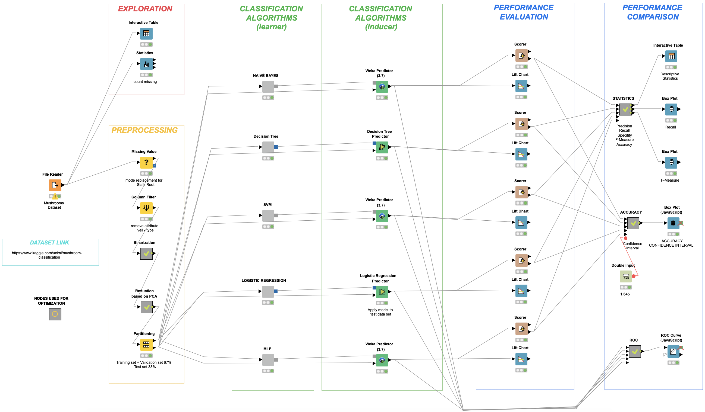

 
 

# Mushrooms-Classification
This Project has been developed by me and [Lorenzo Pastore](https://github.com/LorenzoPastore).
This project exploits the capability of Machine Learning algorithms to classify edible and poisonous mushrooms

The Dataset "Mushrooms Classification" is available on Kaggle: https://www.kaggle.com/uciml/mushroom-classification.

I used Knime to develop the project. Workflow is commented in English language, report is written in Italian.

Below the workflow overview:

 

  

    
    
 

 

